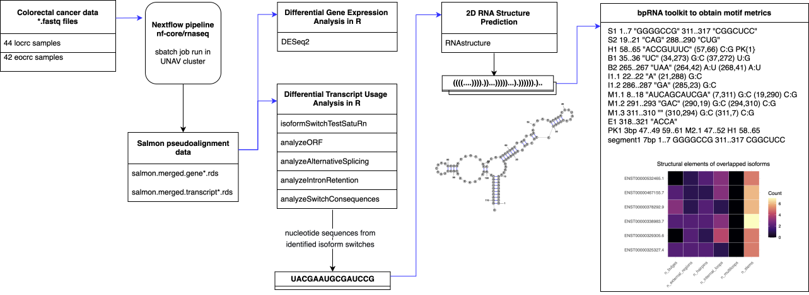

# Integrative Analysis of Differential Gene Expression, Transcript Usage, and RNA Secondary Structure in Early- and Late-Onset Colorectal Cancer

by Salomon Marquez

11/02/2025 

This site contains a summary of my bioinformatics master's thesis developed at CIMA University of Navarra under the supervision of Fernando Pastor Rodriguez and Igor Ruiz de los Mozos.

For a detailed overview of the project, you can check the following resources:

- :material-file-document: [Thesis document](integrative-analysis-dge-dtu-rss-crc/reports/project-progress/tfm-bioinformatics-semv-manuscript.pdf)
- :material-github: [GitHub repository](https://github.com/sblaizerwize/master-bioinformatics)
- :octicons-video-24: [YouTube video](https://youtu.be/atpuYKZB7xI)

  <iframe
    width="560"
    height="315"
    src="https://www.youtube.com/embed/atpuYKZB7xI?si=yhnjEBqGL0c8NW1M"
    title="YouTube video player"
    frameborder="0"
    allowfullscreen>
  </iframe>

---
## Abstract

Colorectal cancer is increasingly diagnosed in individuals younger than 50 years, a
trend referred to as early-onset colorectal cancer. This study applied an integrative
transcriptomic workflow to characterize molecular differences between early-onset
and late-onset colorectal cancer. A total of 86 matched tumor and normal samples
were analyzed using a combination of differential gene expression, differential
transcript usage, and RNA secondary structure prediction.

Differential gene expression analysis identified a 40-gene signature uniquely deregulated
in early-onset colorectal cancer, enriched in immune-related, inflammatory, and
cell-matrix adhesion processes. Differential transcript usage analysis revealed substantial
differences in transcript-level complexity between cohorts, with late-onset
colorectal cancer showing extensive isoform remodeling, whereas early-onset tumors
displayed a more restricted pattern of transcript usage. Despite these global differences,
six conserved isoform switches were consistently detected in both cohorts,
including TPM2, LMNB2, MAP3K20, and the long non-coding RNA HOXB-AS3.
RNA secondary structure prediction further characterized significant isoforms, revealing
a predominance of stem motifs.

These results indicate that gene-level and isoform-level analyses capture complementary
aspects of colorectal cancer transcriptomic variation. The integrative framework
presented here provides a methodological basis for future large-scale studies
and supports the exploration of RNA structural features as potential biomarkers
and therapeutic targets in colorectal cancer.

**keywords**: `colorectal-cancer`, `deseq2-analysis`, `dtu-analysis`, `rna-structure-prediction`, `nf-core-rnaseq`, `isoformSwitchAnalyzeR`, `hpc-cluster`, `nextflow`

---
## Objective  

The primary goal of this project is to identify genes and transcripts that are differentially
regulated in early-onset and late-onset colorectal cancer, and to evaluate whether changes
in isoform usage are associated with differences in their RNA secondary structure through
computational prediction.

---
## Proposed solution
We adopted an integrative transcriptomic strategy to investigate molecular differences
between early-onset and late-onset colorectal cancer (EOCRC and LOCRC). Building
upon a previously conducted gene-level study from [Marx et al.](https://www.frontiersin.org/journals/oncology/articles/10.3389/fonc.2024.1365762/full), we extend the analysis by incorporating
isoform-level regulation and RNA secondary structure prediction, thereby moving beyond expression
changes alone to explore post-transcriptional and structural layers of regulation. The overall integrative analysis workflow is summarized below:

Schematic overview of the integrative transcriptomic analysis workflow implemented in this study.

---
## From concept to implementation
The main milestones of this project were tracked using a dedicated 🏁 [roadmap](https://github.com/users/sblaizerwize/projects/5/views/4?visibleFields=%5B%22Title%22%2C%22Status%22%2C%22Milestone%22%2C224733603%2C224733604%5D&sortedBy%5Bdirection%5D=desc&sortedBy%5BcolumnId%5D=224733604) on GitHub projects, which facilitated version control and documentation of analytical decisions. Among these decisions, the main technical and methodological challenges encountered during the development of this project and the mitigation strategies adopted are listed below:

- [Report 1](integrative-analysis-dge-dtu-rss-crc/reports/project-progress/tfm-proposal.pdf) - the proposal
- [Report 2](integrative-analysis-dge-dtu-rss-crc/reports/project-progress/tfm-report-update-1.pdf) - the starting point
- [Report 3](integrative-analysis-dge-dtu-rss-crc/reports/project-progress/tfm-report-update-2.pdf) - the tipping point

---
## Summary of products obtained
This project produced the following deliverables.

- :material-file-document: A [master’s thesis manuscript](integrative-analysis-dge-dtu-rss-crc/reports/project-progress/tfm-bioinformatics-semv-manuscript.pdf) documenting the analytical workflow, results, and their
biological interpretation.
- :simple-nextflow: A configured and validated **nf-core/rnaseq Nextflow pipeline** for reproducible RNA-seq
analysis on high-performance computing (HPC) clusters.
- :simple-zenodo: A [Zenodo repository](https://doi.org/10.5281/zenodo.17801437) hosting primary and processed
data generated in this study.
- :material-github: A [GitHub repository](https://github.com/sblaizerwize/master-bioinformatics) containing primary scripts and documentation.

---
## Results
This is a summary of results after the implementation of the integrative transcriptomic workflow for the analysis of EOCRC and LOCRC samples.

### **1. nf-core/rnaseq pipeline — EOCRC**
SRA study [SRP357925](https://trace.ncbi.nlm.nih.gov/Traces/index.html?view=study&acc=SRP357925)  
21 EOCRC patient pairs

- [MultiQC Report](integrative-analysis-dge-dtu-rss-crc/reports/nfcore-rnaseq-42samples/multiqc_report.html)
- [Nextflow Report](integrative-analysis-dge-dtu-rss-crc/reports/nfcore-rnaseq-42samples/report.html)
- [Nextflow Timeline](integrative-analysis-dge-dtu-rss-crc/reports/nfcore-rnaseq-42samples/timeline.html)

### **2. nf-core/rnaseq pipeline — LOCRC**
SRA study [SRP479528](https://trace.ncbi.nlm.nih.gov/Traces/index.html?study=SRP479528)  
22 LOCRC patient pairs

- [MultiQC Report](integrative-analysis-dge-dtu-rss-crc/reports/nfcore-rnaseq-44samples/multiqc_report.html)
- [Nextflow Report](integrative-analysis-dge-dtu-rss-crc/reports/nfcore-rnaseq-44samples/report.html)
- [Nextflow Timeline](integrative-analysis-dge-dtu-rss-crc/reports/nfcore-rnaseq-44samples/timeline.html)

### **3. Differential Gene Expression (DGE)**
- [EOCRC samples](integrative-analysis-dge-dtu-rss-crc/reports/dge-analysis/Deseq2_42crc.html)
- [LOCRC samples](integrative-analysis-dge-dtu-rss-crc/reports/dge-analysis/Deseq2_44crc.html)

### **4. Differential Transcript Usage (DTU)**
- [EOCRC and LOCRC samples](integrative-analysis-dge-dtu-rss-crc/reports/dtu-analysis/dtu-read-rds-isoforms_42_44.html)

### **5. RNA Secondary Structure Analysis (RSS)**
- [Common EOCRC and LOCRC isoforms](integrative-analysis-dge-dtu-rss-crc/reports/secondary-rna-structure-analysis/motifs_plots.html)

---
## Contributing
This is a thesis repository, but suggestions for improvements are welcome via [GitHub issues](https://github.com/sblaizerwize/master-bioinformatics/issues).